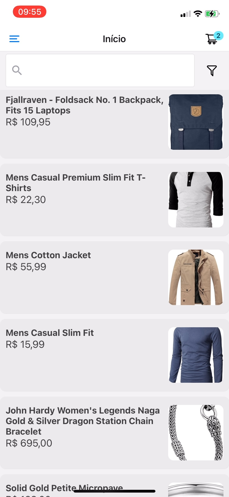

<p align="center">
 
</p>

<div align="center">

[](https://github.com/kylelobo/The-Documentation-Compendium/issues)
[](https://github.com/kylelobo/The-Documentation-Compendium/pulls)
[](LICENSE.md)

</div>

---

<p align="center"> Aplicativo de e-commerce multiplataforma
    <br> 
</p>

## 🏁 Getting Started <a name = "getting_started"></a>

Para execução do projeto basta cloná-lo em sua máquina local.

### Pré-requisitos

Ambiente de desenvolvimento com Node (npm, npx).

### Instalação

Instale as dependências do projeto.

```
npm install
```

E por fim inicialize o projeto. Caso utilize um simulador ou um device físico, a opção de executar será disponibilzada no próprio prompt.

```
expo start
```


## ⛏️ Stack de tecnologias <a name = "tech_stack"></a>

- [React Native](https://www.mongodb.com/) 
- [Expo](https://expo.dev/) - Para desenvolvimento em iOS sem precisar de MacOS
- [React Navigation V6](https://vuejs.org/) - Navegação entre telas
- [Redux](https://redux-toolkit.org/) - Para gerenciamento de estado da aplicação
- [Styled Components](https://redux-toolkit.org/) - Estilização de componentes
- [Native Base V6](https://redux-toolkit.org/) - Componentes visuais reutilizáveis

## ✍️ Authors <a name = "authors"></a>

- [@diaraujo13](https://github.com/kylelobo) - Desenvolvedor


